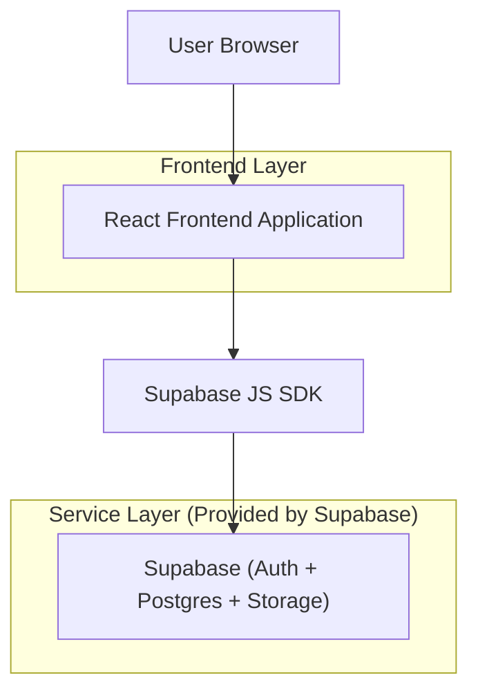
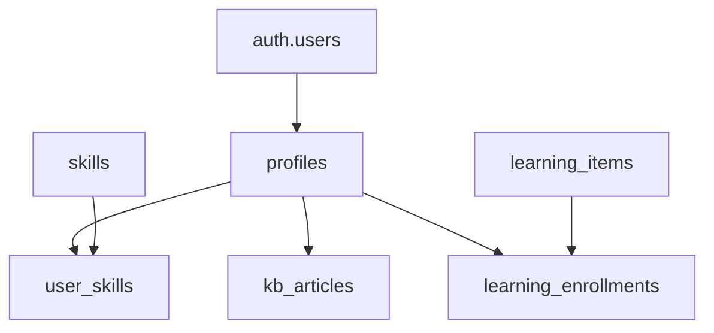

## 1.Architecture design


## 2.Technology Description
- Frontend: React@18 + TypeScript + vite + tailwindcss@3
- State/Data: TanStack Query (server state) + Zustand (UI state, опционально)
- Routing: react-router
- Backend: None (используем Supabase напрямую из фронтенда)
- Auth/DB/Storage: Supabase

## 3.Route definitions
| Route | Purpose |
|-------|---------|
| /login | Вход и восстановление доступа |
| / | Главная (Workspace): поиск, обзор «Моё», быстрые действия |
| /knowledge | База знаний: каталог, фильтры |
| /knowledge/:id | Карточка материала |
| /knowledge/new | Создание материала |
| /knowledge/:id/edit | Редактирование материала |
| /talent | Таланты и навыки: каталог людей, фильтры |
| /talent/:id | Профиль сотрудника |
| /learning | Обучение: каталог |
| /learning/:id | Карточка обучения |
| /profile | Профиль и настройки |
| /admin | Админ-панель (доступ только по роли) |

## 6.Data model(if applicable)

### 6.1 Data model definition
Сущности (логические связи, без жёстких FK):
- profiles: расширение пользователя (user_id, имя, команда/роль, публичные поля профиля)
- skills: справочник навыков (название, категория)
- user_skills: навыки пользователя (user_id, skill_id, level, updated_at)
- kb_articles: материалы базы знаний (id, title, body, author_id, tags, status, updated_at)
- learning_items: элементы обучения (id, title, provider, level, tags)
- learning_enrollments: записи на обучение (user_id, learning_item_id, status, progress)



### 6.2 Data Definition Language
```
-- profiles
CREATE TABLE profiles (
  user_id UUID PRIMARY KEY,
  full_name TEXT,
  team TEXT,
  title TEXT,
  bio TEXT,
  updated_at TIMESTAMPTZ DEFAULT NOW()
);

-- skills
CREATE TABLE skills (
  id UUID PRIMARY KEY DEFAULT gen_random_uuid(),
  name TEXT NOT NULL,
  category TEXT,
  is_active BOOLEAN DEFAULT TRUE
);

-- user_skills
CREATE TABLE user_skills (
  id UUID PRIMARY KEY DEFAULT gen_random_uuid(),
  user_id UUID NOT NULL,
  skill_id UUID NOT NULL,
  level SMALLINT NOT NULL,
  updated_at TIMESTAMPTZ DEFAULT NOW()
);

-- kb_articles
CREATE TABLE kb_articles (
  id UUID PRIMARY KEY DEFAULT gen_random_uuid(),
  title TEXT NOT NULL,
  body TEXT NOT NULL,
  author_id UUID NOT NULL,
  tags TEXT[] DEFAULT '{}',
  status TEXT DEFAULT 'published',
  updated_at TIMESTAMPTZ DEFAULT NOW()
);

-- learning_items
CREATE TABLE learning_items (
  id UUID PRIMARY KEY DEFAULT gen_random_uuid(),
  title TEXT NOT NULL,
  provider TEXT,
  level TEXT,
  tags TEXT[] DEFAULT '{}'
);

-- learning_enrollments
CREATE TABLE learning_enrollments (
  id UUID PRIMARY KEY DEFAULT gen_random_uuid(),
  user_id UUID NOT NULL,
  learning_item_id UUID NOT NULL,
  status TEXT DEFAULT 'active',
  progress SMALLINT DEFAULT 0,
  updated_at TIMESTAMPTZ DEFAULT NOW()
);

-- базовые гранты (минимальные чтения для anon — только если есть публичные данные)
GRANT SELECT ON skills TO anon;
GRANT SELECT ON skills TO public;

-- полный доступ для авторизованных
GRANT ALL PRIVILEGES ON profiles TO authenticated;
GRANT ALL PRIVILEGES ON skills TO authenticated;
GRANT ALL PRIVILEGES ON user_skills TO authenticated;
GRANT ALL PRIVILEGES ON kb_articles TO authenticated;
GRANT ALL PRIVILEGES ON learning_items TO authenticated;
GRANT ALL PRIVILEGES ON learning_enrollments TO authenticated;
```

Примечание по безопасности: включить RLS для всех таблиц и описать политики (например, сотрудник может изменять только свои profiles/user_skills/enrollments; чтение знаний/каталога — по роли и статусу материала).