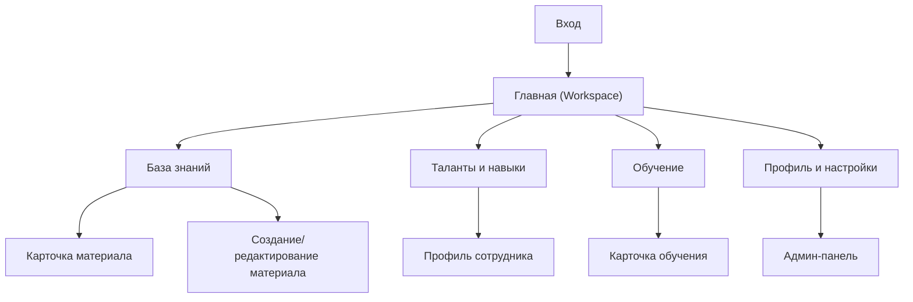

## 1. Product Overview
Talent & Knowledge OS — единое рабочее пространство для управления знаниями и развитием талантов в компании.
Помогает сотрудникам быстро находить знания, развивать навыки и поддерживать прозрачный профиль компетенций.

## 2. Core Features

### 2.1 User Roles
| Role | Registration Method | Core Permissions |
|------|---------------------|------------------|
| Сотрудник | Приглашение от компании (email/SSO) | Просматривать/искать знания, создавать/редактировать свои материалы, вести профиль навыков, проходить обучение |
| Руководитель | Как сотрудник | Всё как сотрудник + просматривать талант-панель команды (люди/навыки/развитие) |
| HR/Администратор | Назначение роли администратором | Управлять пользователями/ролями, таксономией навыков, контентом и базовыми настройками системы |

### 2.2 Feature Module
Наши требования состоят из следующих основных страниц:
1. **Вход**: аутентификация, восстановление доступа.
2. **Главная (Workspace)**: глобальный поиск, быстрые действия, обзор «мои знания/мои навыки/мои обучения».
3. **База знаний**: поиск, категории/теги, просмотр материала, создание/редактирование материала.
4. **Таланты и навыки**: каталог людей, карточка профиля, матрица навыков (просмотр/самооценка).
5. **Обучение**: каталог, карточка обучения, запись/отметка прогресса.
6. **Профиль и настройки**: личные данные, настройки уведомлений, (для админов) вход в админ-панель.
7. **Админ-панель**: пользователи и роли, навыки/категории, модерация контента.

### 2.3 Page Details
| Page Name | Module Name | Feature description |
|-----------|-------------|---------------------|
| Вход | Аутентификация | Войти по email/SSO; восстановить доступ; выйти из аккаунта |
| Главная (Workspace) | Глобальная навигация и поиск | Переключаться между разделами; искать по знаниям/людям/обучениям; открывать результаты |
| Главная (Workspace) | Обзор «Моё» | Просматривать закреплённые/недавние материалы; видеть свои навыки и ближайшие действия; видеть активные обучения |
| База знаний | Каталог и фильтры | Просматривать список материалов; фильтровать по категориям/тегам/автору; сортировать по релевантности/дате |
| База знаний | Карточка материала | Читать материал; смотреть метаданные (автор, теги, обновление); копировать ссылку |
| База знаний | Создание и редактирование | Создавать материал; редактировать черновик; публиковать/обновлять; управлять тегами |
| Таланты и навыки | Каталог людей | Искать и открывать профили; фильтровать по роли/команде/навыкам |
| Таланты и навыки | Профиль сотрудника | Просматривать компетенции, опыт и материалы; переходить к связанным знаниям/обучениям |
| Таланты и навыки | Матрица навыков | Просматривать набор навыков; обновлять самооценку (для себя); просматривать команду (для руководителя) |
| Обучение | Каталог | Просматривать программы/курсы; фильтровать по теме/уровню; открывать карточку |
| Обучение | Запись и прогресс | Записываться; отмечать прогресс/завершение; видеть статус в «Моё обучение» |
| Профиль и настройки | Профиль | Редактировать личные данные; управлять видимостью отдельных полей профиля |
| Профиль и настройки | Настройки | Настраивать уведомления и предпочтения; открывать админ-панель при наличии прав |
| Админ-панель | Пользователи и роли | Приглашать/деактивировать пользователей; назначать роли; сбрасывать доступ |
| Админ-панель | Таксономия | Управлять навыками, категориями и тегами; объединять/архивировать сущности |
| Админ-панель | Контент | Модерировать материалы (скрыть/восстановить); управлять владельцем/метаданными |

## 3. Core Process
**Поток сотрудника**: войти → на главной выполнить поиск или открыть «Моё» → прочитать материал/перейти в профиль коллеги → обновить свои навыки → открыть обучение и записаться/обновить прогресс.

**Поток руководителя**: войти → открыть «Таланты и навыки» → отфильтровать команду → открыть профили и сравнить навыки → перейти к знаниям/обучениям для закрытия гэпов.

**Поток HR/админа**: войти → админ-панель → пригласить пользователей/назначить роли → настроить навыки/категории → поддерживать качество контента.

